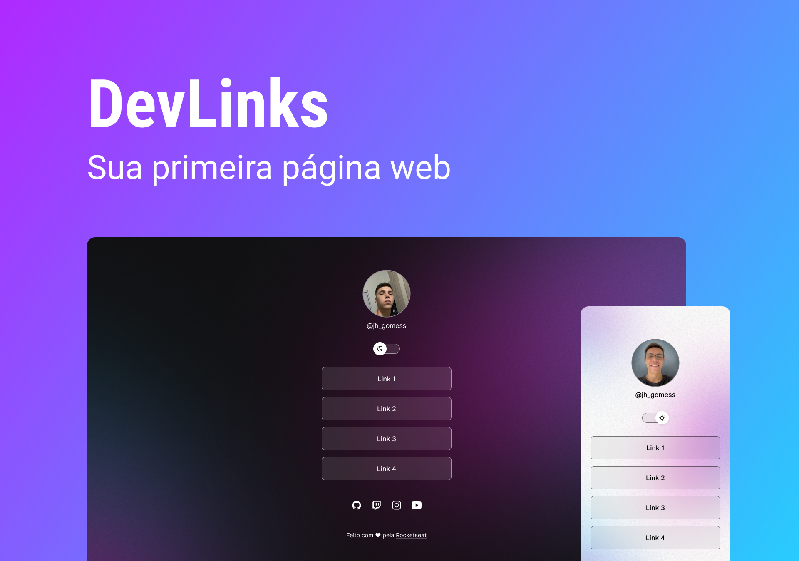

<h1 align="center"> DISCOVER - DEVLINKS </h1>

Programa exclusivo e gratuito, promovido pela Rocketseat para ensino de tecnologias WEB.  
<a href="https://www.rocketseat.com.br/discover?utm_source=google&utm_medium=cpc&utm_campaign=lead&utm_term=perpetuo&utm_content=publicofrio-lead-discover-texto-lead-kws-none-none-discover-aprendadozero-none-br-sitelink&utm_term=discover%20rocketseat&utm_campaign=PROGRAMAS-ALL-BRANDKWS-SEM&utm_source=adwords&utm_medium=ppc&hsa_acc=8545075154&hsa_cam=16048648686&hsa_grp=135825188594&hsa_ad=579096962131&hsa_src=g&hsa_tgt=kwd-1158927825993&hsa_kw=discover%20rocketseat&hsa_mt=b&hsa_net=adwords&hsa_ver=3&gclid=CjwKCAjwjOunBhB4EiwA94JWsHP_wxVh9sTwGPftBJiAKDg5Bo9aRb5fm4mqjx1ur3jfj3XtnSPdHBoCVfQQAvD_BwE">Estude esse projeto em formato de vídeo clicando aqui.</a>

  <a href="#-tecnologias">Tecnologias</a>&nbsp;&nbsp;&nbsp;|&nbsp;&nbsp;&nbsp;
  <a href="#-projeto">Projeto</a>&nbsp;&nbsp;&nbsp;|&nbsp;&nbsp;&nbsp;
  <a href="#-layout">Layout</a>&nbsp;&nbsp;&nbsp;|&nbsp;&nbsp;&nbsp;
  <a href="#memo-licença">Licença</a>

  

 

  

## 🚀 Tecnologias

Esse projeto foi desenvolvido com as seguintes tecnologias:

- HTML e CSS
- JavaScript
- Git e Github
- Figma

## 💻 Projeto

O DevLinks é um agregador de links para usar como cartão de visitas online.

- [Acesse o projeto finalizado, online](https://jhgomess.github.io/Discover/)

- [Assistir aulas](https://www.rocketseat.com.br/discover?utm_source=google&utm_medium=cpc&utm_campaign=lead&utm_term=perpetuo&utm_content=publicofrio-lead-discover-texto-lead-kws-none-none-discover-aprendadozero-none-br-sitelink&utm_term=discover%20rocketseat&utm_campaign=PROGRAMAS-ALL-BRANDKWS-SEM&utm_source=adwords&utm_medium=ppc&hsa_acc=8545075154&hsa_cam=16048648686&hsa_grp=135825188594&hsa_ad=579096962131&hsa_src=g&hsa_tgt=kwd-1158927825993&hsa_kw=discover%20rocketseat&hsa_mt=b&hsa_net=adwords&hsa_ver=3&gclid=CjwKCAjwjOunBhB4EiwA94JWsHP_wxVh9sTwGPftBJiAKDg5Bo9aRb5fm4mqjx1ur3jfj3XtnSPdHBoCVfQQAvD_BwE)

## 🔖 Layout

Você pode visualizar o layout do projeto através [DESSE LINK](<https://www.figma.com/file/dN4kV8G3qPPmTNM3BnG002/DevLinks-%E2%80%A2-Projeto-Discover-(Community)?node-id=10%3A620&mode=dev>). É necessário ter conta no [Figma](https://figma.com) para acessá-lo.

## :memo: Licença

Esse projeto está sob a licença MIT.

---

Feito com ♥ by Rocketseat :wave: [Participe da nossa comunidade!](https://discord.gg/rocketseat)
